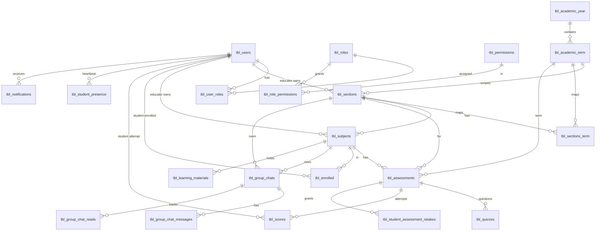
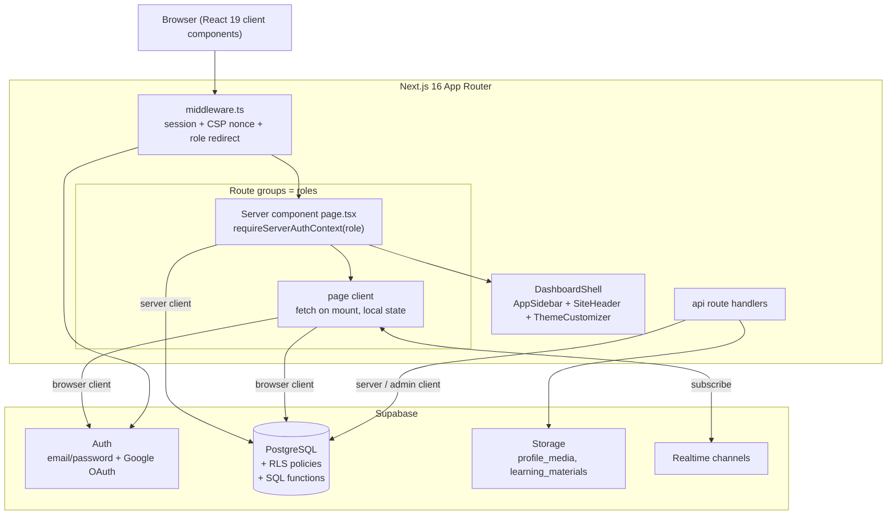
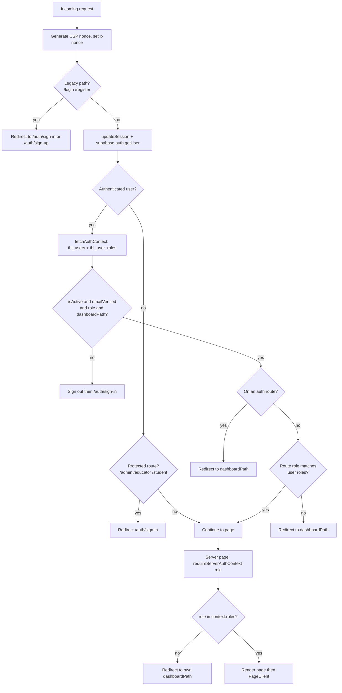
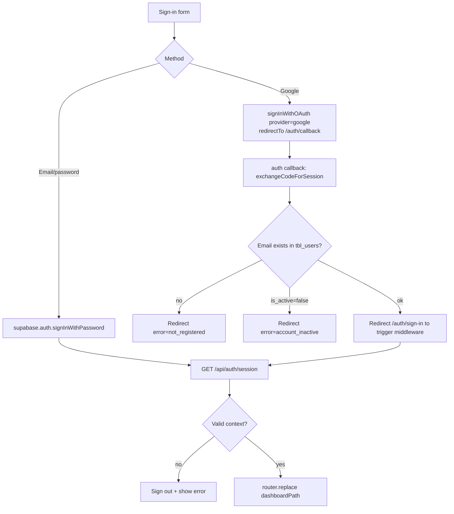
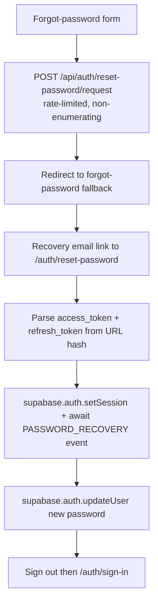
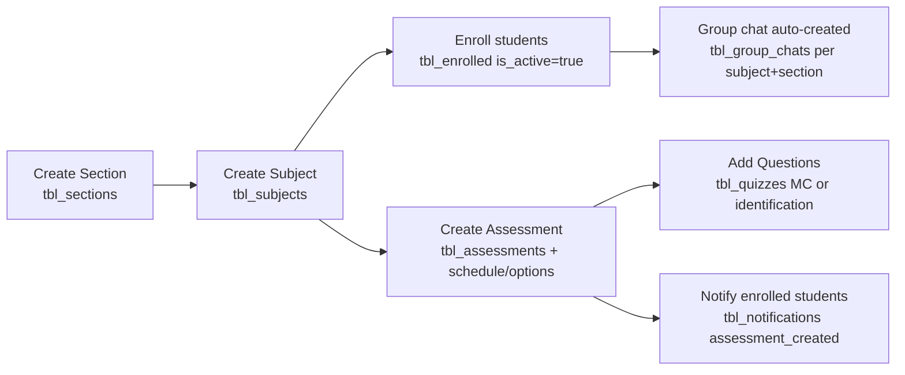
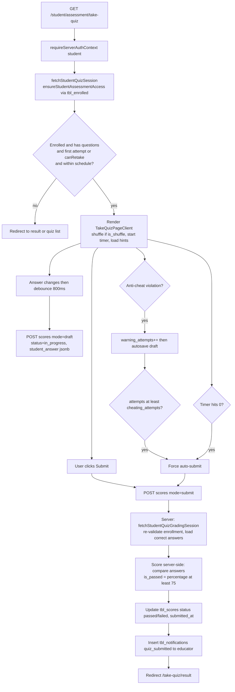
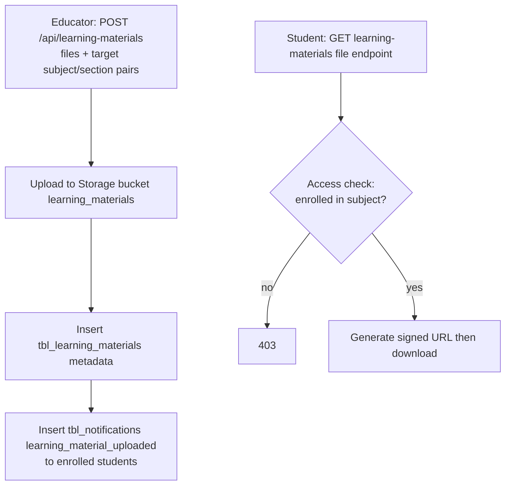
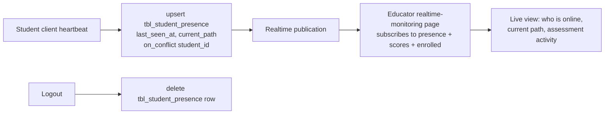

# Qyzen — Technical Architecture & Flow Analysis

> Analysis-only document. Describes the system **as it currently exists**. No code was changed to produce it.
> Audience: developers. A plain-language companion lives in [ARCHITECTURE_OVERVIEW.md](ARCHITECTURE_OVERVIEW.md).

---

## 1. Tech Stack

| Layer | Technology |
|-------|-----------|
| Framework | **Next.js 16.2.9** (App Router; dev server runs on **webpack**, not Turbopack) |
| UI runtime | **React 19.2** |
| Language | **TypeScript 5.9** (strict mode; type-checking is done via `pnpm build`) |
| Styling | **Tailwind CSS v4** (`@tailwindcss/postcss`) + `tw-animate-css` |
| Components | **shadcn/ui** on **Radix UI** primitives (`src/components/ui/`) |
| Icons | **@tabler/icons-react** (preferred); `lucide-react` also installed |
| Forms / validation | **react-hook-form** + **Zod** via `@hookform/resolvers` (`src/lib/validations/`) |
| Tables | **@tanstack/react-table** |
| Charts | **Recharts** |
| Drag & drop | **@dnd-kit** |
| Spreadsheet export | **ExcelJS** (`.xlsx`) + **JSZip** (bundling) |
| Client state | **zustand** |
| Toasts | **sonner** |
| Theming | **next-themes** + custom theme customizer (localStorage `qyzen-theme-*`) |
| Backend / DB / Auth / Storage / Realtime | **Supabase** (`@supabase/ssr`, `@supabase/supabase-js`) |
| Package manager | **pnpm 10.33** |

**Scripts:** `pnpm dev` (webpack), `pnpm build` (prod build + type check), `pnpm lint` (Next.js ESLint). There is **no test suite**.

**Required env (`.env.local`):** `NEXT_PUBLIC_SUPABASE_URL`, `NEXT_PUBLIC_SUPABASE_ANON_KEY`, `SUPABASE_SERVICE_ROLE_KEY`.

---

## 2. Database

**Type: PostgreSQL — fully relational** (managed by Supabase). It is *not* a document/NoSQL store: data is normalized across ~21 tables joined by integer foreign keys, with unique constraints, btree indexes, and `ON DELETE CASCADE` / `SET NULL` rules. `jsonb` is used only for two flexible fields (`tbl_quizzes.choices`, `tbl_scores.student_answer`) and notification `metadata`.

Schema and operational SQL are checked into [database/](../database/):

| Folder | Contents |
|--------|----------|
| `schema/` | `DatabaseSchema.sql` (full public schema), `DatabaseAuthSchema.sql` |
| `sql/tables/` | Per-table `CREATE TABLE` scripts |
| `sql/migrations/` | Historical changes (e.g. `rename_modules_to_assessments`, retake fields, profile media) |
| `sql/indexes/` | Performance indexes |
| `sql/realtime/` | `enable_realtime_*` (Realtime publication) |
| `sql/triggers/` | e.g. `enforce_tbl_users_self_service_update_columns` |
| `policies/` | Per-table RLS policy scripts (`apply_*_rbac_policies.sql`) |
| `functions/` | `user_has_permission`, `get_group_chat_list`, `get_group_chat_messages` |
| `backups/` | Pre-migration snapshots (2026-06) |

### Table inventory (grouped)

**Identity & RBAC**
- `tbl_users` — all profiles (`user_type` = student/educator/admin); soft-deleted via `deleted_at`; unique `email`, `user_id`. Holds `profile_picture`, `cover_photo`.
- `tbl_roles`, `tbl_permissions` (with `permission_string`, e.g. `assessments:view`), `tbl_role_permissions` (M:N), `tbl_user_roles` (M:N, soft-delete via `deleted_at`).

**Academic structure**
- `tbl_academic_year` → `tbl_academic_term` (FK `academic_year_id`).
- `tbl_sections` (owned by `educator_id`, tied to `academic_term_id`), `tbl_sections_term` (M:N section↔term), `tbl_subjects` (per educator + section, unique code/name per section).

**Assessments / quizzes / scores**
- `tbl_assessments` — quiz metadata: `time_limit`, `is_shuffle`, `allow_review`, `allow_retake`, `retake_count`, `allow_hint`, `hint_count`, `cheating_attempts`, scheduling (`start/end_date`, `start/end_time`), `term`. Unique per `(assessment_code, subject_id, section_id, term)`.
- `tbl_quizzes` — questions: `quiz_type` (multiple-choice / identification), `choices` (jsonb), `correct_answer`.
- `tbl_scores` — one row per student attempt: `score`, `total_questions`, `student_answer` (jsonb), `warning_attempts`, `status` ∈ {`in_progress`,`submitted`,`passed`,`failed`}, `is_passed`, `taken_at`, `submitted_at`.
- `tbl_student_assessment_retakes` — educator-granted `extra_retake_count` per `(educator, student, assessment)`.

**Enrollment, chat, notifications, materials, presence**
- `tbl_enrolled` — student↔subject per educator (`is_active` gates access); unique `(educator_id, student_id, subject_id)`.
- `tbl_group_chats` (one per educator+subject+section), `tbl_group_chat_messages`, `tbl_group_chat_reads` (per-user read marker).
- `tbl_notifications` — event-driven; `event_type` CHECK-constrained (e.g. `quiz_submitted`, `assessment_created`, `learning_material_uploaded`); actor/recipient + nullable resource FKs (`SET NULL`).
- `tbl_learning_materials` — file metadata per subject/section (see `sql/tables/create_tbl_learning_materials_table.sql`); files live in Supabase Storage buckets (`learning_materials`, `profile_media`).
- `tbl_student_presence` — heartbeat (`last_seen_at`, `current_path`), unique per `student_id`.

### Security model — RLS is the primary authorization layer

Row-Level Security is **enabled on every table**, and policies are written `TO authenticated` using two SQL helper functions:

- `has_role('<role>')` — does the current auth user hold this role?
- `user_has_permission('<permission_string>')` — does the current user's roles grant this permission? (joins `tbl_user_roles → tbl_roles → tbl_role_permissions → tbl_permissions`)
- `get_current_tbl_user_id()` — maps the Supabase auth user to their `tbl_users.id`.

Representative policy shapes (from `DatabaseSchema.sql`):
- **Admin**: `has_role('admin')` → full access on all admin-owned tables.
- **Educator (ownership)**: e.g. assessments — `has_role('educator') AND educator_id = get_current_tbl_user_id()`. Sections/subjects additionally require the matching `user_has_permission('sections:view'…)`.
- **Student (enrollment-gated)**: e.g. a student may `SELECT` an assessment only if an active `tbl_enrolled` row links them to that assessment's educator + subject.

> ⚠️ Operational note: never revoke `authenticated` EXECUTE on `has_role` / `get_current_tbl_user_id` / `user_has_permission`, or the app hangs at "Redirecting to dashboard".

**Realtime** is enabled on `tbl_enrolled`, `tbl_assessments`, `tbl_quizzes`, `tbl_scores`, `tbl_student_presence`, `tbl_notifications`, `tbl_group_chats`, `tbl_group_chat_messages`, `tbl_group_chat_reads`, `tbl_learning_materials`.

### Entity-Relationship Diagram

---

## 3. System Architecture

Qyzen is a single Next.js App Router application. The `src/app/` directory is split into **route groups that map 1:1 to roles**, and authorization is enforced in **two layers** (edge middleware, then per-page server check) backed by **database RLS** as the final gate.

**Route groups** (`src/app/`):
- `(auth)/auth/` — public: `sign-in`, `sign-up`, `forgot-password` (+ `/fallback`), `reset-password`, `callback` (OAuth).
- `(admin)/admin/` — `dashboard`, `users`, `access-control/{roles,permissions}`, `academic-settings/{academic-year,academic-term}`.
- `(educator)/educator/` — `dashboard`, `classroom/{sections,subjects,group-chats}`, `enrollment`, `assessment/{quizzes,assessments}`, `scores`, `materials`, `group-chats/*`, `realtime-monitoring`.
- `(student)/student/` — `dashboard`, `assessment/{quiz,take-quiz,take-quiz/result,scores}`, `materials`, `chats`.
- `(profile)/profile/` — shared profile/avatar/email settings.
- `template/` — **UI reference/preview pages only; not wired to real data** (do not treat as live routes).
- `/` — minimal landing; redirects authenticated users to their dashboard.

**Server/client split (the repeated pattern):** every protected page is a server component (`page.tsx`) that calls `requireServerAuthContext('role')` then renders a `*PageClient`. The client component fetches from `src/lib/supabase/*` on mount and manages local state. `DashboardShell` (`src/components/layouts/dashboard-shell.tsx`) wraps authenticated pages (sidebar driven by role; hidden on the quiz-taking page).

**Three Supabase clients** (`src/lib/supabase/`):
- `server.ts` — `createServerClient` (`@supabase/ssr`), cookie-bound; for server components/actions.
- `client.ts` — `createBrowserClient`, singleton; for client components.
- `admin.ts` — service-role `createClient`, no session persistence; only for privileged ops (e.g. auth email sync, user creation).

**CSP nonce:** middleware generates a per-request nonce and sets `script-src 'self' 'nonce-…' 'strict-dynamic'`; this requires `force-dynamic` rendering in `layout.tsx`.

---

## 4. Process & Flow (flowcharts)

### 4.1 Request → middleware → auth context → role redirect

Role priority in `fetchAuthContext` (`src/lib/auth/auth-context.ts`): `admin > educator > student`, falling back to `tbl_users.user_type`. `dashboardPath` = `/{role}/dashboard`.

### 4.2 Sign-in (email/password + Google OAuth)

### 4.3 Password reset

### 4.4 Educator authoring chain

Each step is gated by educator ownership + `user_has_permission` RLS (sections/subjects) and writes via `src/lib/supabase/{sections,subjects,enrollments,assessments,quizzes}.ts`.

### 4.5 Student quiz lifecycle (end-to-end)

Key guarantee: **correct answers never reach the client** — grading happens in the `submit` branch of `src/app/api/student/assessment/scores/[assessmentId]/route.ts` using a server-only grading session.

### 4.6 Learning materials: upload → signed-URL download

### 4.7 Realtime monitoring / presence

---

## 5. API Surface (`src/app/api/`)

| Endpoint | Methods | Purpose | Guard |
|----------|---------|---------|-------|
| `/api/auth/session` | GET | Validate session, return `{ dashboardPath }` | session + `fetchAuthContext` |
| `/api/auth/reset-password/request` | POST | Send recovery email (rate-limited, non-enumerating) | public |
| `(auth)/auth/callback` | GET | OAuth code exchange; Google sign-in & account link | session-aware |
| `/api/users` | GET, POST | List managed users / create user (auth + profile + role) | admin (service-role client) |
| `/api/users/[userId]` | DELETE | Delete auth account + profile | admin |
| `/api/users/[userId]/resend-verification` | POST | Resend verification email | admin |
| `/api/users/bulk` | POST | Bulk student import (dedupe + validate) | admin |
| `/api/learning-materials` | GET, POST | List materials / upload + distribute + notify | educator |
| `/api/learning-materials/[materialId]` | PATCH, DELETE | Update metadata or file / delete + storage cleanup | educator |
| `/api/learning-materials/[materialId]/file` | GET | Signed download URL (access-checked) | enrolled student/educator |
| `/api/student/assessment/scores/[assessmentId]` | POST | Save draft or submit (server-side scoring + notify) | student (`getStudentApiContext`) |
| `/api/profile/settings` | POST | Update name / email / profile picture / cover photo | self |

---

## 6. Key File Map

| Concern | Path |
|---------|------|
| Edge auth + CSP | `src/middleware.ts`, `src/lib/supabase/middleware.ts` |
| Auth context & role logic | `src/lib/auth/auth-context.ts`, `src/lib/auth/server.ts` |
| Permission checks | `src/lib/auth/server-permissions.ts`, `*-permissions.ts` |
| Supabase clients | `src/lib/supabase/{server,client,admin}.ts` |
| Data layer (35 modules) | `src/lib/supabase/*.ts` |
| Validation schemas | `src/lib/validations/*` |
| Shared layout | `src/components/layouts/dashboard-shell.tsx` |
| UI primitives | `src/components/ui/*` (shadcn) |
| Quiz scoring API | `src/app/api/student/assessment/scores/[assessmentId]/route.ts` |
| Score export | `src/app/(educator)/educator/scores/utils/workbook-utils.ts`, `src/lib/spreadsheets/xlsx-reader.ts` |
| Database SQL | `database/` |

---

## 7. Realtime & direct-from-browser data access

Not all server interaction goes through `src/app/api/*`. Several features use the **browser Supabase client directly** — Realtime subscriptions and a couple of direct table writes — so they have **no `/api` route** (RLS is the authorization gate for these). This is the counterpart to the §5 API table: the live/realtime surface.

| Feature | File(s) | Mechanism |
|---------|---------|-----------|
| Student presence heartbeat | `take-quiz-page-client.tsx`, `src/lib/supabase/student-presence.ts` | direct `upsert tbl_student_presence` every 25s (`onConflict: student_id`); row deleted on logout |
| Educator realtime monitoring | `realtime-monitoring-page-client.tsx` | `channel().on('postgres_changes', tbl_student_presence / tbl_scores)` |
| Group chat | `group-chats-page-client.tsx`, `src/lib/supabase/group-chat-shared.ts` | Realtime `INSERT` on `tbl_group_chat_messages`; direct write to `tbl_group_chat_reads` (mark-read); list/history via RPC `get_group_chat_list` / `get_group_chat_messages` |
| Admin dashboard live refresh | `dashboard-realtime-shell.tsx` | Realtime on 11 tables → debounced `router.refresh()` |
| Notification bell | `notification-bell.tsx` | Realtime subscription on `tbl_notifications` for the current user |

Realtime is enabled on the tables listed in §2 (`sql/realtime/enable_realtime_*`). Storage access: profile media is public-URL; learning materials are private and served via **60-second signed URLs** through `/api/learning-materials/[materialId]/file` after an enrollment check.

> 🛠️ **Migrating off Supabase?** These direct-from-browser calls are the easiest thing to miss in a rewrite — they have no endpoint to translate. The full migration analysis (Next.js + Supabase → Laravel + MySQL) lives in **[MIGRATION_LARAVEL_MYSQL.md](MIGRATION_LARAVEL_MYSQL.md)**.

---

## 8. Quiz runtime behavior (anti-cheat, hints, autosave)

The take-quiz client (`src/app/(student)/student/assessment/take-quiz/`) enforces exam integrity on top of the server-side grading guarantee (§4.5). It is **client-side detection, server-side enforcement** — the browser detects and counts violations, but the score and pass/fail are still computed on the server.

**Anti-cheat detectors** (`hooks/anti-cheat-detectors.ts`, wired via `handleAntiCheatViolation` in `take-quiz-page-client.tsx`):

| Type | Detector | Effect |
|------|----------|--------|
| `tab-hidden` | `visibilitychange` → `hidden` | counts a violation |
| `window-blur` | window `blur` (alt-tab) | counts a violation |
| `copy-paste` | `copy` / `cut` / `paste` on the quiz container | blocked + counted |
| — | `contextmenu` (right-click) | blocked |
| — | devtools shortcuts: `F12`, `Ctrl/⌘+Shift+I/J/C`, `Ctrl/⌘+U` | blocked |
| — | `PrintScreen` | screen blurred briefly |

Each counted violation increments `warning_attempts` and triggers a draft autosave. When `warning_attempts` reaches the assessment's `cheating_attempts` limit, the quiz **force auto-submits** (one-shot, guarded by `autoSubmitTriggeredRef`). Timer reaching zero also force-submits.

**Hints** (when `allow_hint`): up to `hint_count` hints surface at random moments during the time window (`getRandomHintMoments`), shown as rotating toasts from a shuffled pool — they are not requested by the student.

**Autosave:** answer changes debounce ~800ms → `POST /api/student/assessment/scores/[assessmentId]` with `mode=draft` (`status=in_progress`), so a dropped connection doesn't lose work.

---

## 9. Client-side state (zustand)

Most client components are stateless beyond local `useState` and fetch-on-mount (§3). Only two **real** zustand stores exist (the others under `src/app/template/` are UI-preview scaffolding, not wired to data):

- `(student)/student/assessment/quiz/use-quiz.ts` — tracks the `selected` quiz id in a list (trivial UI state).
- `(student)/student/chats/use-chat.ts` — chat UI state (conversations, messages, selected conversation, typing/online indicators). **UI state only** — message data comes from the data-layer fetch functions and Realtime (§7), not from the store itself.

Neither store is a data cache; both hold view state. Server data always flows through `src/lib/supabase/*` + Realtime.

---

## 10. Security response headers

Beyond the per-request CSP nonce set in middleware (§3), static security headers are applied globally via `next.config.ts` `headers()`:

| Header | Value |
|--------|-------|
| `Strict-Transport-Security` | `max-age=31536000; includeSubDomains` |
| `X-Frame-Options` | `DENY` |
| `X-Content-Type-Options` | `nosniff` |
| `Referrer-Policy` | `origin-when-cross-origin` |
| `Permissions-Policy` | `camera=(), microphone=(), geolocation=(), payment=(), usb=()` |
| `Cross-Origin-Opener-Policy` | `same-origin` |
| `X-Permitted-Cross-Domain-Policies` | `none` |
