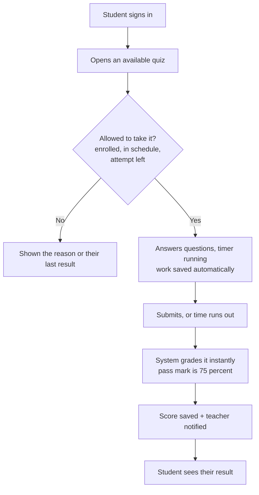
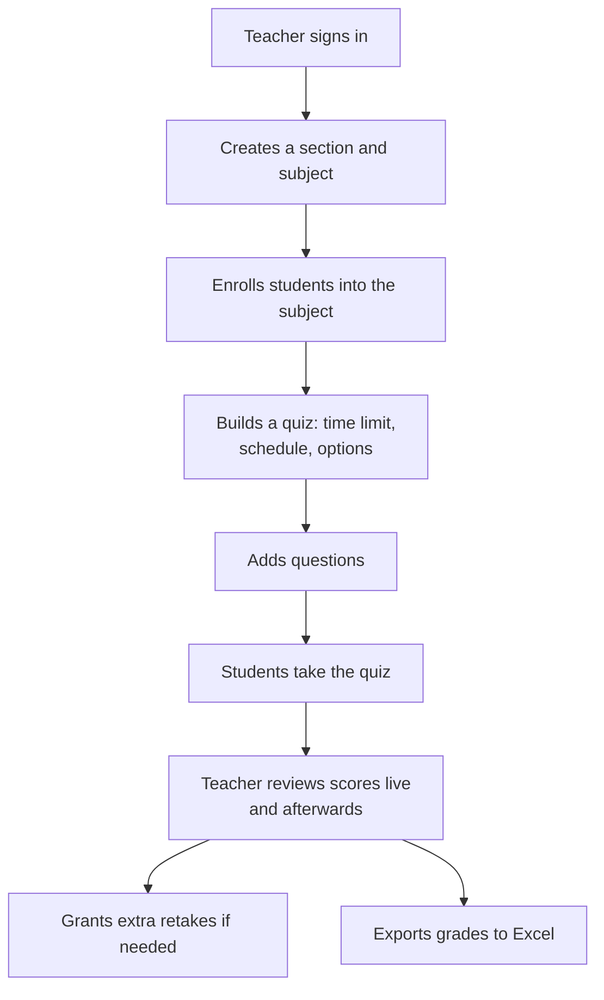

# Qyzen — Plain-Language Overview

> A non-technical companion to [ARCHITECTURE_TECHNICAL.md](ARCHITECTURE_TECHNICAL.md). It explains what Qyzen is, who uses it, and how it works from start to finish — no jargon required.
>
> 🛠️ Migrating the system? See [MIGRATION_LARAVEL_MYSQL.md](MIGRATION_LARAVEL_MYSQL.md) — the coupling, hidden direct-to-Supabase calls, runtime requirements, and a port checklist for a Laravel + MySQL rewrite. For an exhaustive per-role action list, see [FEATURE_MATRIX.md](../roadmap/FEATURE_MATRIX.md).

---

## 1. What Qyzen is

**Qyzen is a web-based quiz and learning-management system for schools.** Teachers build online quizzes and learning materials, students take those quizzes in their browser, and the system grades them automatically and keeps a record of every score. Everything runs in a web browser — there is nothing to install.

There are three kinds of users, and each gets their own area of the app:

- **Admins** run the school setup — accounts, roles, and academic years.
- **Educators** (teachers) create classes, enroll students, write quizzes, share materials, and review results.
- **Students** join their classes, take quizzes, view their scores, and read class materials.

The app keeps each group's tools and data separate, so a student only ever sees their own classes and scores, and a teacher only sees the students they actually teach.

---

## 2. Who uses it & what they can do

### Admin
- Create and manage user accounts (one at a time or by bulk import).
- Decide what each role is allowed to do (roles and permissions).
- Set up the school calendar: academic years and terms.

### Educator (teacher)
- Create class **sections** and **subjects**, and **enroll** students into them.
- Build **assessments** (quizzes) with a time limit, scheduling, optional shuffling, hints, and retake rules.
- Add questions (multiple-choice or fill-in-the-answer).
- Share **learning materials** (files) with chosen classes.
- **Review scores**, grant extra retakes, and export grades to Excel.
- Chat with a class in a **group chat**, and watch a **live monitor** of who is currently taking a quiz.

### Student
- See the classes they're enrolled in.
- Take available quizzes within the scheduled window.
- See their results and whether they passed (pass mark is 75%).
- Read class materials and join class chats.

---

## 3. How it works, from start to end

### The student journey

A student signs in, opens an available quiz, answers the questions while a timer runs, and submits. The system grades it instantly, records the score, and tells the teacher. Their work is saved continuously as they go, so a dropped connection won't lose their answers.

### The educator journey

A teacher sets up a class, brings students in, builds a quiz, and later reviews how everyone did.

---

## 4. What keeps it safe and reliable

- **Accounts and roles.** Everyone signs in with email/password or a Google account. The app always checks who you are and what role you have before showing any page — and checks a second time on the database itself, so people can only ever reach their own data.
- **Access by enrollment.** Students can only see and take quizzes for classes they're actually enrolled in. Teachers only see their own students.
- **Honest grading.** Quizzes are graded by the server, not in the browser, and the correct answers are never sent to the student's device — so scores can't be tampered with. The quiz also watches for cheating (like switching away from the window) and can auto-submit if the limit is reached.
- **Nothing gets lost.** Answers are saved automatically as a student works.
- **Live updates.** Teachers can watch, in real time, who is online and who is taking a quiz right now.
- **Exports.** Grades can be downloaded as Excel files for record-keeping.

---

## 5. Glossary

| Plain term | What it means in Qyzen |
|------------|------------------------|
| Account | A user's login (admin, educator, or student) |
| Role | The kind of user you are, which decides what you can do |
| Section | A class group |
| Subject | A course taught to a section |
| Enrollment | Adding a student into a subject so they can access it |
| Assessment | A quiz, with its rules (time limit, schedule, retakes) |
| Question | An item in a quiz — multiple-choice or fill-in-the-answer |
| Score | A student's recorded result for one quiz attempt |
| Retake | Permission to attempt a quiz again |
| Group chat | Class messaging between a teacher and their students |
| Live monitor | The teacher's real-time view of student activity |
| Learning material | A file (notes, handout) shared with a class |
| Notification | An in-app alert (e.g. "a quiz was submitted") |
